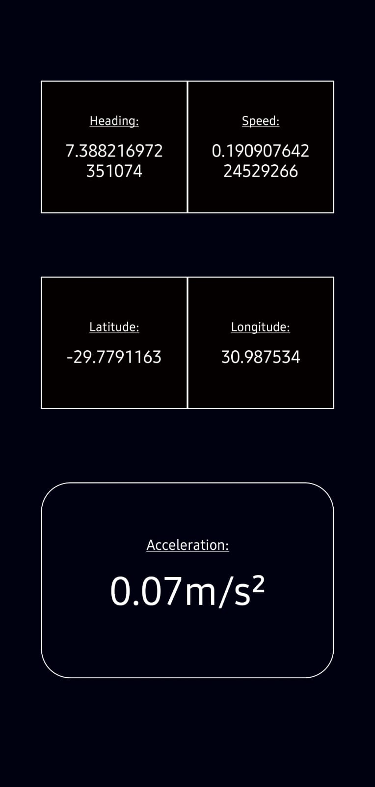
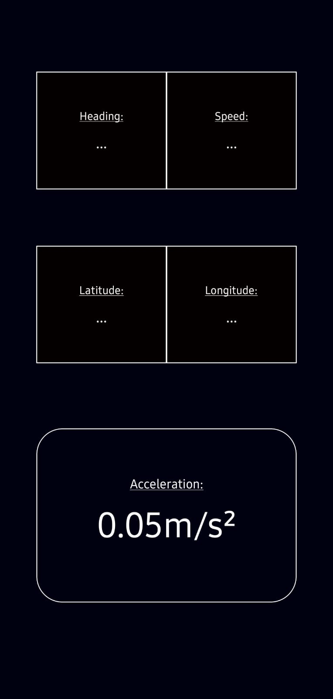
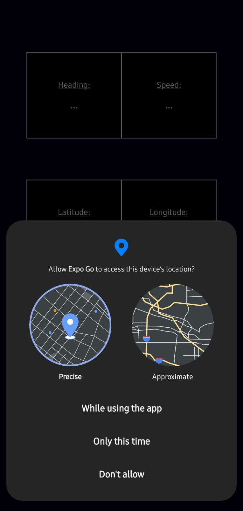
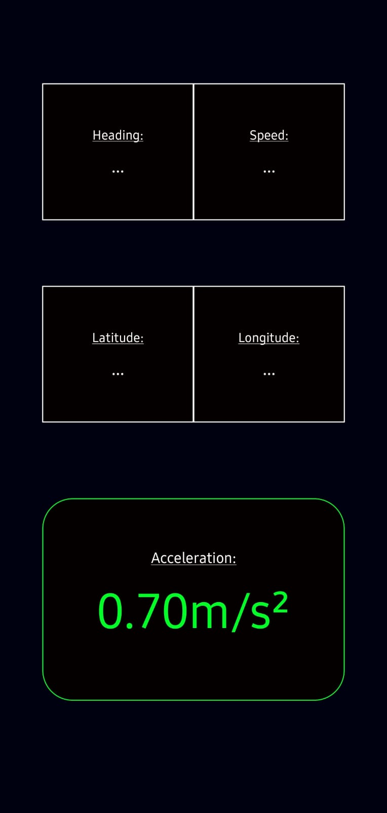
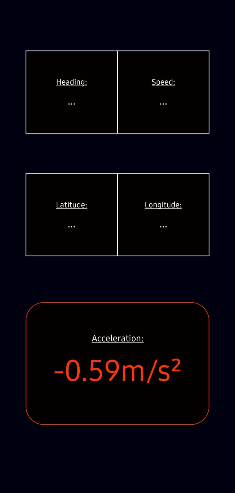

Simple variometer (781)
For raw project instructions see: http://syllabus.africacode.net/react-native/simple-vario/intro/

## Instructions

- _npm i_
- _npx expo start_

---

## Extra Information

This app does not require any user interaction, just open and watch out for birds.

### Screenshots

